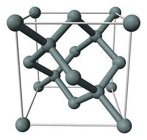

# VASP 计算上机实例

### 计算内容说明



我们以钻石结构的 Si 为例进行计算. 

本文件夹内共包含 8 个文件夹, **除了 7-1 和 7-2 需要复制第 6 步自洽计算得到的电荷密度文件以外, 其余文件夹中均已经包含所有必须的 VASP 输入文件, 提交任务脚本以及绘图脚本.** 各文件夹说明如下所示.

-   `0_diamond_a`: 晶格常数测试.
-   `1_diamondSi_encut`: 截断能测试.
-   `2_diamondSi_kpoint`: k-网格密度测试.
-   `3_diamondSi_sigma`: sigma 参数测试.
-   `4_diamondSi_vol_rex`: 利用 VASP 内置算法优化晶格常数.
-   `5-1_diamondSi_relax`: 利用 VASP 内置算法优化原子位置.
-   `5-2_diamondSi_relax_select`: 利用 VASP 内置算法优化原子位置.
-   `6_diamondSi_self_c`: 自洽计算, 为后续能带和态密度计算准备电荷密度文件.
-   `7-1_diamondSi_band`: Si 能带计算.
-   `7-2_diamondSi_dos`: Si 态密度计算.

更多 VASP 计算实例, 可以参考 [VASP wiki examples](https://cms.mpi.univie.ac.at/wiki/index.php/Category:Examples).

>   部分计算结果已经放在 `img` 文件夹内, 以供参考.

### 计算过程

1. 对于 0-3 文件夹中的参数测试, 直接使用 `cd` 命令进到相应文件夹里面, 使用 `sbatch run.script` 命令即可提交. 使用 `squeue -u username` 查看自己提交的任务的运行情况.

    1. 计算完成以后, 文件夹内会多出很多计算的文件, 比如标准的输出日志 `job_%jobid.out` 文件. 以及最后计算结果汇总文件 `summary.txt`.
    2. 使用 `gnuplot summary.gnu` 运行画图脚本, 使用 `ls` 命令检查是否有新生成的文件.
    3. 打开 winSCP, 将生成的图片下载下来即可查看.
    4. 几个最后生成的结果见 `img` 文件夹.

2. 对于 4, 5-1, 5-2 这几个优化晶格的文件夹, 同样使用 `sbatch run.script` 提交任务, 标准输出日志同样存储为 `job_%jobid.out` , 可以查看电子步和离子步的输出. 最后 VASP 优化结束的晶格以和 `POSCAR` 同样的格式保存在 `CONTCAR` 中.

    1. 在 `4_..._vol_rex` 中最后优化完毕以后的 `CONTCAR` 文件内, 前几行分别为

        ```
        cubic diamond
           5.50000000000000
             0.0000000000000000    0.4970802510482874    0.4970802510482874
             0.4970802510482874   -0.0000000000000000    0.4970802510482874
             0.4970802510482874    0.4970802510482874   -0.0000000000000000
        ...
```
        
    可以看到优化完毕以后的晶格常数对应于 $5.5\times0.49708\times2\approx 5.468$.
    
    
    2. 在 5-1 中计算优化完毕以后的 `CONTCAR` 文件如下所示.
    
        ```
        ...
        Direct
         -0.0005157081288633 -0.0005157081288633  0.0268060441637205
          0.2505157081288633  0.2505157081288633  0.2731939558362766
        ...
        ```
    
        由于 `INCAR` 中 `ISIF` 参数的设置, 我们并不修改晶格的大小.
    
    3. 在 5-2 中计算优化完毕以后的 `CONTCAR` 文件如下所示.
    
        ```
        ...
        Selective dynamics
        Direct
          0.0000000000000000  0.0000000000000000  0.0000000000000000   F   F   F
          0.2507065540018392  0.2507065540018392  0.2471972199450896   T   T   T
        ...
        ```
    
        在 `POSCAR` 中设置一个原子固定让另一个原子优化. 可以在实际计算的过程中修改 `INCAR` 中的 `EDIFF` 和 `EDIFFG` 的大小, 检验精度对于我们结构弛豫最终结果的影响.
    
3. 在开始 7-1 和 7-2 的能带与态密度计算之前, 我们需要先进行一步 6 中的自洽计算. 直接利用 `sbatch run.script` 命令提交计算任务. 详细的参数请看 `INCAR` 文件中的设置. 

    1. 计算完成后, 需要将 6 计算的 `CHGCAR` 文件复制到 7-1 和 7-2 中 (如果你熟悉 Linux 操作的话, 也可以使用 `ln -s` 命令创建链接).
    2. 上一步准备好的 `CHGCAR` 文件将作为这一步非自洽计算的输入文件. 所谓非自洽, 其实就是计算过程中不再更新电子密度, `INCAR` 中 `ICHARG = 11`. 提交任务的方式和之前介绍的完全相同.
    3. 能带计算完成后, 可以利用 winSCP 将 `vasprun.xml` 文件下载下来, 并使用 p4vasp 进行分析.
    4. 态密度计算完成后, 执行命令 `sh plotdos.sh` 运行, 即可产生态密度分布图.